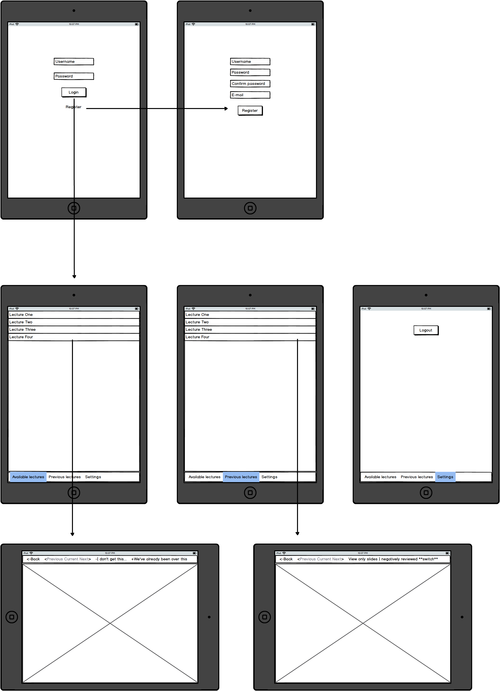
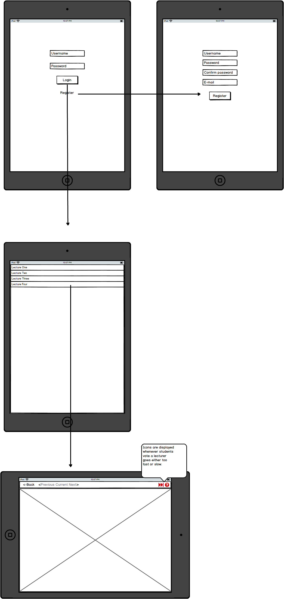
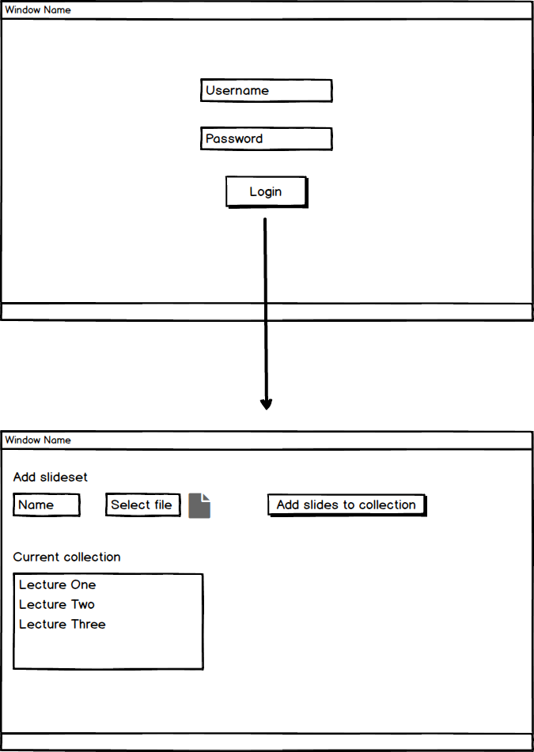

# Feedback during lectures

Most students know the feeling, you're attending a lecture and the lecturer goes so fast through the materials you get confused. Or the lecturer goes on and on about subjects that were dealt with earlier. Raising your hand interrupts the lecture however so there is no good way to do something about this, yet...

This problem I want to solve by building an application. When the lecturer uses my application to display his slideshows the students will have the possibility to follow the slideshow on their phones/tablets. But most important: they can send their feedback (either too slow or too fast) to the lecturer. The feedback of course will not be displayed in an intrusive manner, but just as a subtle notification, and only when a certain fraction of the students submits the same feedback.

This idea is born during one of my earlier courses, where my team developed an idea for a system that provides adaptive slides during lectures. The feedback was a part of this, but some lecturers showed interest in primarily this part of the system. This drove me to choose the feedback on slides as subject for this project.

Here you can see the student-version of the app. The students logs in and has access to live lectures and previous lectures.

Here you can see the view for the lecturer, this person can select a lecture to play and while playing the lecture the feedback from the students will become available.

Here you can see the web view of the application. This view is only for managing the slide-collection of a lecturer. I have chosen not to do this from the app since most lecturers have their slideshows only on their PCs, and first having to transfer them to their phones/tablets would be very user-unfriendly.

For all this to work I need a way for real-time bidirectional event-based communication. For this purpose I will use [Socket.IO](https://www.socket.io).
I will further need a server for all clients to connect to, and to process and store the slideshows. For this I will use a VPS from [DigitalOcean](https://www.digitalocean.com), installed with [Ubuntu](https://www.ubuntu.com) and [Python](https://python.org) with libraries [[Flask](http://flask.pocoo.org), [PyPDF2](https://pypi.python.org/pypi/PyPDF2/1.26.0), [Socket.IO](https://pypi.python.org/pypi/python-socketio)].
For authentication and database purposes I will make use of [Firebase](https://firebase.google.com). 

To make a MVP some parts of the idea outlined above can be omitted. Primarily the function for students to look back at previous lectures.
