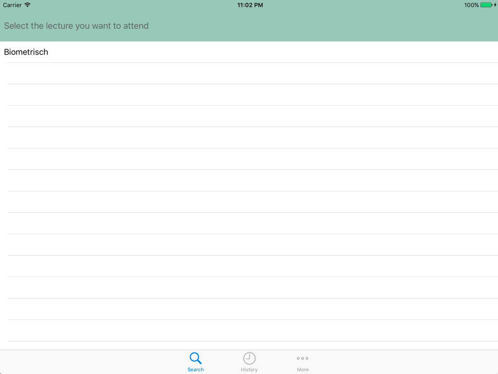
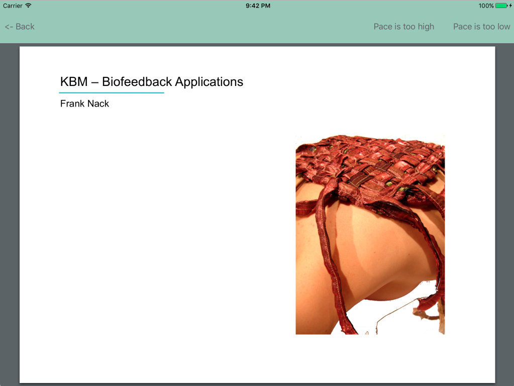
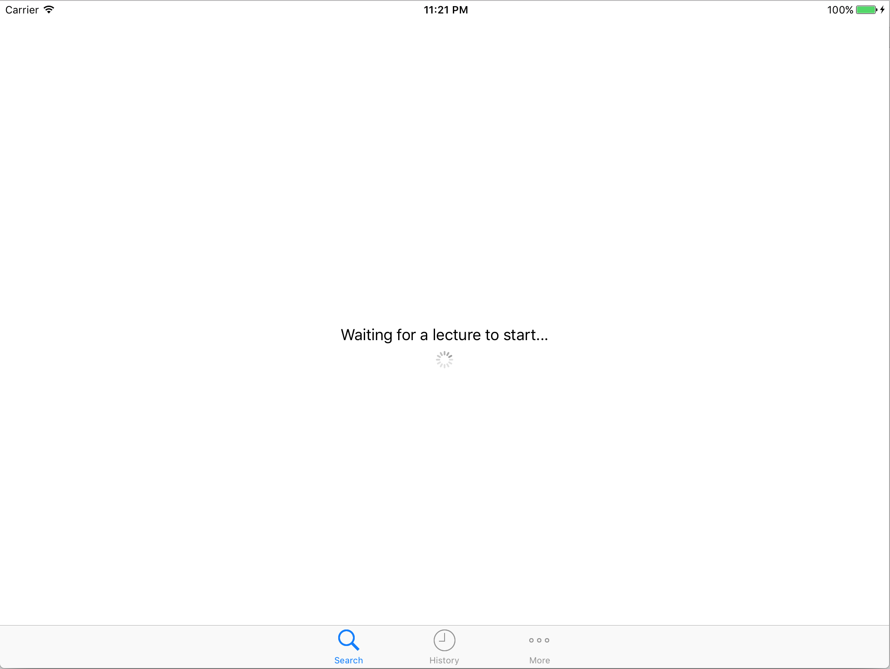
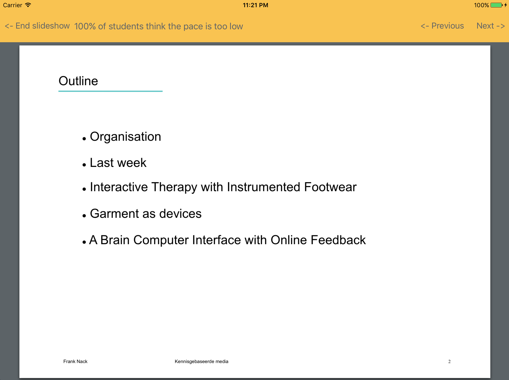
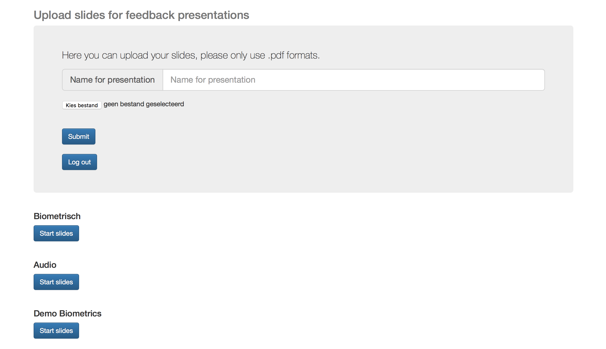

# SlideFeedback

## About

Most students know the feeling, you're attending a lecture and the lecturer goes so fast through the materials you get confused. Or the lecturer goes on and on about subjects that were dealt with earlier. Raising your hand interrupts the lecture however so there is no good way to do something about this, yet...

This problem I tried to solve by building an application. When the lecturer uses my application to display his slideshows the students will have the possibility to follow the slideshow on their phones/tablets. But most important: they can send their feedback (either too slow or too fast) to the lecturer. The feedback of course will not be displayed in an intrusive manner, but just as a subtle notification, and only when a certain fraction of the students submits the same feedback.

This application has several components:

Most important: the iOS app, located under /SlideFeedback/. This app permits students to join current lectures and give feedback on them as can be seen below:

For lecturers it looks quite similar. Except they enter in a waiting screen, which redirects them to a slideshow when one is started from the webapplication. Please see below (the slideview is displayed with feedback):

The history tab is quite similar, students en lecturers can browse through the lectures they have attended/given and see their own feedback or those from their students. Under settings is the possibility to log out.

The next component is the server. This one is written in Python, using Flask-Socket.IO. The code can be found at /WebServer/Final/slidesapp/\__init\__.py.

The final component is the website from where lecturers can upload and start slideshows. The code for this item can be found at /WebServer/Final/slidesapp/templates and /WebServer/Final/slidesapp/static. It is first needed to log in, after that the screen below appears:

## References

Used pods:
- Firebase pods for Swift
- Socket.IO-Client-Swift

## License
*This product is licensed under the Unlicense. For more info see LICENSE file.*
