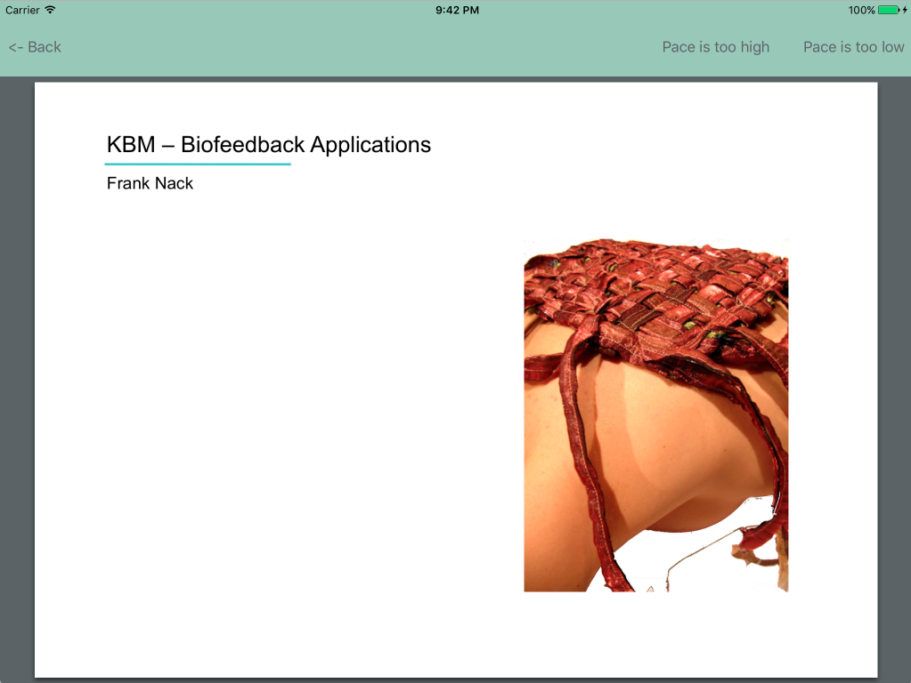
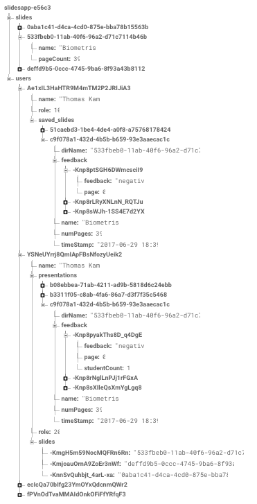

# SlideFeedback

## Introduction
Most students know the feeling, you're attending a lecture and the lecturer goes so fast through the materials you get confused. Or the lecturer goes on and on about subjects that were dealt with earlier. Raising your hand interrupts the lecture however so there is no good way to do something about this, yet...

This problem I try to solve by building an application. When the lecturer uses my application to display his slideshows the students will have the possibility to follow the slideshow on their phones/tablets. But most important: they can send their feedback (either too slow or too fast) to the lecturer. The feedback of course will not be displayed in an intrusive manner, but just as a subtle notification, and only when a certain fraction of the students submits the same feedback.

This idea is born during one of my earlier courses, where my team developed an idea for a system that provides adaptive slides during lectures. The feedback was a part of this, but some lecturers showed interest in primarily this part of the system. This drove me to choose the feedback on slides as subject for this project.

Below is a screenshot of the student view:

## Technical Design

For all this to work I need a way for real-time bidirectional event-based communication. For this purpose I will use [Socket.IO](https://www.socket.io).
I will further need a server for all clients to connect to, and to process and store the slideshows. For this I will use a VPS from [DigitalOcean](https://www.digitalocean.com), installed with [Ubuntu](https://www.ubuntu.com) and [Python](https://python.org) with libraries [[Flask](http://flask.pocoo.org), [PyPDF2](https://pypi.python.org/pypi/PyPDF2/1.26.0), [Socket.IO](https://pypi.python.org/pypi/python-socketio)].

For authentication and database purposes I will make use of [Firebase](https://firebase.google.com). This database will be used to store information on users and slideshows, as can be seen in the following image:

The necessary real-time communication (next/previous slide, available slides and feedback) will be provided by Socket.IO. On the server, the rooms (presentations) are managed. A client can take control of a room when he/she is a lecturer, and "normal" clients can join a room. When the lecturer emits a changePage event, the matching room is found and the event is retransmitted to everyone in there. When feedback comes in, the lecturer of the room is located and he or she gets the feedback from the server. This works the same way for other events.

When we look at the code for the app itself the MVC-principle is used, although this is almost forced on you by Apple :-). Every screen in the UI has its own UIViewController. Some extensions are used to implement specific functions, such as the spacing and sizing of the UIWebView or displaying alerts in a UIViewcontroller. Firebase and Socket.IO will both get a model/manager in the form of a singleton, to prevent multiple connections etc. These singletons contain all code related to SocketIO and Firebase, this is nice for code maintainability, for instance if you would decide to switch to another library for socket-communication, you will only have to make adjustments in that specific file. Events within the app are handled using the NotificationCenter.

